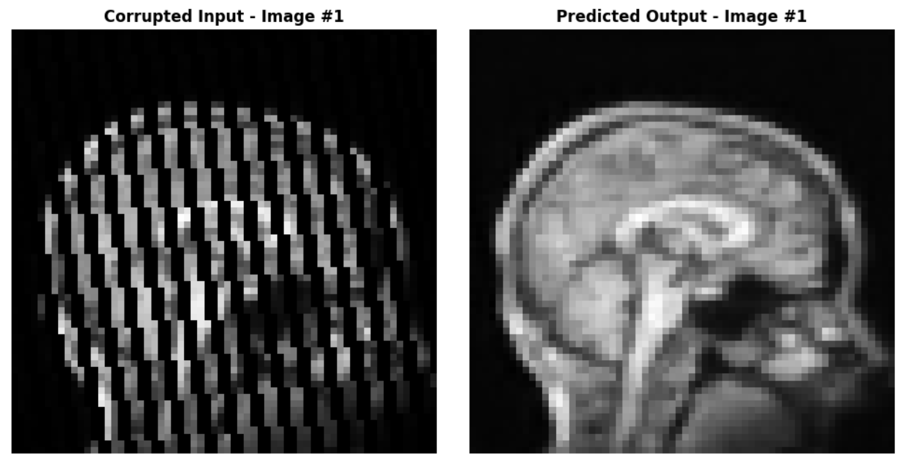
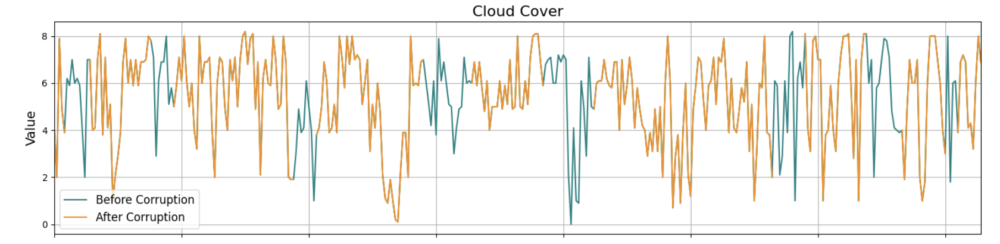

#  *** Data Science & Machine Learning Projects Portfolio***

Welcome to my portfolio! This space showcases data science and machine learning projects completed during my academic journey and free time. Since it has only been 2 months since I started my data science and machine learning journey, I plan on adding some more projects soon. 

---

## 📚 **Academic Projects**

### 1. **Imputing Missing Portions of MRI Scans**
- **Description**:  
  - Developed a neural network architecture to recover missing portions of MRI images of human heads.  
  - This addressed a key imputation problem in magnetic resonance imaging (MRI) where incomplete scans prevent detailed patient analysis.  

- **Technologies**: Python, PyTorch, NumPy, Matplotlib  
- **Data**:  
  - ***Training***: Artificially generated realistic MRI images for model training (using a pre-trained generative model).  
  - ***Testing***: Corrupted MRI images stored in `test_set.npy` (100 images of size 64x64 pixels).  

- **Approach**:  
  - Created preprocessing pipelines to apply corruption masks to clean MRI images for supervised learning.  
  - Designed and trained a **U-Net architecture** on the corrupted and clean MRI images.  
  - Evaluated model performance on unseen corrupted MRI images to measure reconstruction accuracy.  

- **Results**:  

- **Repository**: [GitHub Link](https://github.com/ese-ada-lovelace-2024/dl-module-coursework-1-esemsc-mi720)

---

### 2. **Time Series Weather Data Imputation**
- **Description**:  
  - Developed a neural network to recover missing daily weather measurements from sequential time-series data.  
  - Addressed corrupted weather data over multiple decades, using both clean and corrupted datasets for training and testing.  

- **Technologies**: Python, LSTM/Transformer models, Pandas, TensorFlow, Matplotlib, Seaborn.  
- **Data**:  
  - ***Training***:  
    - `training_set_0.csv`, `training_set_1.csv`, `training_set_2.csv` (corrupted).  
    - `training_set_0_nogaps.csv`, `training_set_1_nogaps.csv`, `training_set_2_nogaps.csv` (clean versions).  
  - ***Testing***: `test_set.csv` (corrupted time-series data for one unseen decade).  
  - ***Variables***: `cloud_cover`, `sunshine`, `global_radiation`, `max_temp`, `mean_temp`, `min_temp`, `precipitation`, `pressure`.  

- **Approach**:  
  - Conducted **EDA** to visualize trends, line plots, and histograms to compare clean vs corrupted data.  
  - Preprocessed data to handle corruption and stabilize inputs.  
  - Trained and validated an **LSTM-based neural network** for time-series data imputation.  

- **Results**:  

- **Repository**: [GitHub Link](https://github.com/ese-ada-lovelace-2024/dl-module-coursework-2-esemsc-mi720)

---

### 3. **Predicting Significant Wave Heights**
- **Description**:  
  - Built a regression model to predict significant wave heights (`Hsig`) based on environmental and oceanic conditions.  
  - The project included data preprocessing, feature engineering, model selection, and performance evaluation.  

- **Technologies**: Python, Pandas, Scikit-learn, Matplotlib  
- **Data**: `Hsig` (wave height), `Temperature`, `Wind Speed`, `Wave Direction`, `Depth`, and seasonal/categorical features.  

- **Approach**:  
  - Preprocessed data using pipelines (handling missing values, encoding, and transformations).  
  - Trained a **baseline Linear Regression** model as a benchmark.  
  - Optimized ensemble models (e.g., **Random Forest**, **Gradient Boosting**) using **RandomizedSearchCV**.  
  - Evaluated models using **R²** and **Mean Squared Error (MSE)** metrics.  

- **Repository**: [GitHub Link](https://github.com/ese-ada-lovelace-2024/dsml-2024-esemsc-mi720)  
- **Notebooks**: Q1.ipynb, Q1_answer.ipynb.

---

### 4. **Predicting Passenger Transportation**
- **Description**:  
  - Developed a classification model to predict whether passengers were successfully transported based on personal and travel-related features.  
  - The project included **model comparison**, **threshold tuning**, and **error analysis**.  

- **Technologies**: Python, Pandas, Scikit-learn, Matplotlib  
- **Data**:  
  - Features: `Age`, `VIP`, `RoomService`, `FoodCourt`, `ShoppingMall`, `Cabin`, `HomePlanet`, `Destination`, `CryoSleep`.  
  - Target: `Transported` (True/False).  

- **Approach**:  
  - Compared **Logistic Regression** and **K-Nearest Neighbors (KNN)** models.  
  - Tuned hyperparameters using **RandomizedSearchCV** with cross-validation.  
  - Evaluated performance using **Accuracy**, **Precision**, **Recall**, **F1-Score**, and **AUC-ROC**.  
  - Adjusted thresholds to minimize errors under two scenarios:  
    - Balanced trade-off between False Positives (FP) and False Negatives (FN).  
    - Prioritized minimizing False Negatives.  

- **Repository**: [GitHub Link](https://github.com/ese-ada-lovelace-2024/dsml-2024-esemsc-mi720)  
- **Notebooks**: Q2.ipynb, Q2_answer.ipynb.

---

## 🏅 **Extracurricular Projects**
